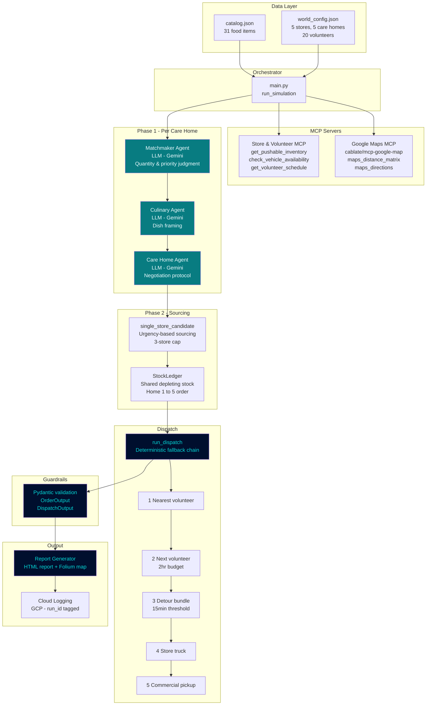

---
# Surplus to Smiles — Agentic Food Distribution

**A multi-agent AI system that rescues near-expiry food from
Chennai supermarkets and routes it to registered Care Homes
via volunteers.**

Built as a capstone project for the Google x Kaggle 5-Day AI
Agents Intensive Vibe Coding Course (Track: Agents for Good).

## Live Demo
**https://food-rescue-989012206196.us-east1.run.app/**
Publicly accessible — no login required. Triggers a full
simulated day run and displays the operations report and map.

## Project Overview
Surplus to Smiles demonstrates an end-to-end agentic food
rescue pipeline for Chennai, India. The system:
- Collects near-expiry surplus food from 5 supermarkets via MCP
- Matches surplus to 5 registered Care Homes using AI reasoning
- Negotiates delivery quantities via structured agent dialogue
- Dispatches 20 volunteers using real Google Maps routing
- Falls back to store trucks or commercial pickup when needed
- Generates a full operations report and delivery map

## Architecture



## Key Design Decisions
- **LLM agents only where ambiguity exists** — Matchmaker,
  Culinary, and Care Home agents use Gemini reasoning.
  All other logic is deterministic Python.
- **MCP for tool/data access** — Store inventory, volunteer
  schedules, and Google Maps routing all accessed via MCP.
- **Sequential negotiation** — Care Homes 1-4 negotiate via
  structured A2A-style dialogue. Care Home 5 auto-accepts
  remainder, ensuring no food goes unallocated.
- **Urgency-aware sourcing** — Essential items flagged urgent
  by care homes are never dropped, sourced across up to 3
  stores if needed.
- **Fixed world, variable daily data** — Entity identities
  (stores, care homes, volunteers) are fixed in
  world_config.json. Inventory and availability randomize
  each run for realistic simulation variance.

## Tech Stack
- Google ADK (Python) — agent framework
- FastMCP — MCP server implementation
- Vertex AI (Gemini 2.5 Flash) — LLM for reasoning agents
- cablate/mcp-google-map — Google Maps MCP integration
- Folium — interactive delivery map
- Pydantic — guardrail validation
- Google Cloud Run — deployment
- Google Cloud Logging — observability

## Local Setup

### Prerequisites
- Python 3.12+
- Node.js (for Google Maps MCP server)
- Google Cloud SDK (gcloud CLI)
- A GCP project with these APIs enabled:
  Vertex AI API, Google Maps Directions API,
  Google Maps Distance Matrix API,
  Cloud Run API, Cloud Logging API

### Installation
```bash
git clone https://github.com/bvsprathap/Surplus-to-Smiles
cd Surplus-to-Smiles
python -m venv .venv
.venv\Scripts\activate  # Windows
pip install -r requirements.txt
npm install -g @cablate/mcp-google-map
```

### Environment Setup
Copy `.env.template` to `.env` and fill in your values:
```
GOOGLE_MAPS_API_KEY=your_maps_api_key
GEMINI_API_KEY=your_gemini_api_key (if not using ADC)
GCP_PROJECT_ID=your_gcp_project_id
```

Configure GCP authentication:
```bash
gcloud auth application-default login
gcloud auth application-default set-quota-project YOUR_PROJECT_ID
```

### Run Locally
```bash
python main.py
```
The simulation runs once and saves:
- `reports/output/report_{run_id}.html` — operations report
- `reports/output/map_{run_id}.html` — delivery map

### Run Tests
```bash
python -m pytest tests/ -v
```
180 tests across 6 test files.

## Project Structure
```
Surplus-to-Smiles/
├── catalog.json          # Fixed food item catalog (31 items)
├── world_config.json     # Fixed Chennai scenario
├── main.py               # Orchestrator entrypoint
├── requirements.txt
├── .env.template
├── data/
│   └── data_model.py     # Pydantic models, world/daily data
├── tools/
│   ├── constraint_tools.py  # Filters, StockLedger, sourcing
│   ├── dispatch.py          # Fallback chain dispatcher
│   ├── guardrails.py        # Pydantic output validation
│   ├── logger.py            # Simulated WhatsApp message log
│   └── models.py            # Pipeline output models
├── agents/
│   ├── matchmaker_agent.py  # Surplus-to-need matching
│   ├── culinary_agent.py    # Dish framing enrichment
│   └── care_home_agent.py   # Negotiation protocol
├── mcp_servers/
│   └── store_volunteer_server.py  # FastMCP server
├── reports/
│   ├── report_generator.py  # HTML report + Folium map
│   └── assets/
│       └── Back_ground_2.png
└── tests/                   # 180 tests, 180/180 passing
```

## Future Work
- Multi-care-home simultaneous negotiation with true
  scarcity-based allocation
- Real WhatsApp Business API integration for volunteer and
  store notifications
- Live memory writeback after each day's negotiation outcomes
- Full multi-stop TSP routing beyond the 15-minute detour check
- Rotating care home outreach order for equitable access
- Real road-following polylines with live traffic timing
- Auto-zoom map to active delivery area
- Grader-controlled simulation refresh via secure URL parameter
- Summary report URL linked from Kaggle writeup

## Competition Context
Built for the Google x Kaggle 5-Day AI Agents Intensive
Vibe Coding Course — Track: Agents for Good.
Demonstrates: Multi-agent system (ADK), MCP integration,
Antigravity vibe coding, Security/guardrails (Pydantic),
and Cloud Run deployment.
---
