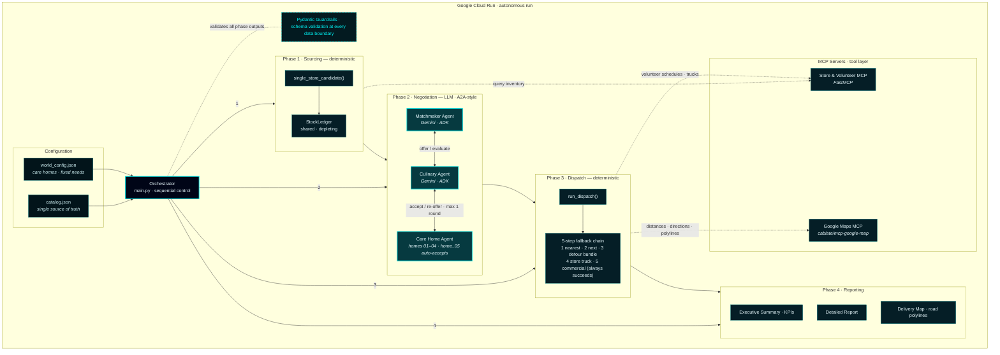
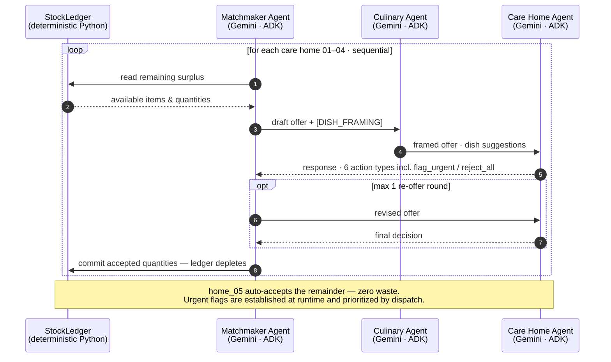

# SurplusCart: Agentic Food Rescue

**A multi-agent AI system that rescues near-expiry food from Chennai
supermarkets and negotiates it to the registered Care Homes that need
it — the same day.**

Built as a capstone project for the Google × Kaggle 5-Day AI Agents
Intensive Vibe Coding Course (Track: **Agents for Good**).

## Live Demo

**https://food-rescue-989012206196.us-east1.run.app/**

Publicly accessible — no login required. The landing page serves the
**most recent completed rescue day** immediately (Executive Summary,
with links to the Detailed Report and Delivery Map).

A fresh simulation involves several minutes of live agent negotiation
(~5 minutes end-to-end), so new runs are triggered through a separate
refresh link and **rate-limited to one run per 15 minutes** to keep
the public deployment stable for all visitors.

## Project Overview

SurplusCart demonstrates an end-to-end agentic food rescue pipeline
for Chennai, India. On every run, the system:

- Collects near-expiry surplus from 5 supermarkets via their own MCP tools
- Matches surplus to 5 registered Care Homes using AI reasoning
- Negotiates quantities via a structured A2A-style agent dialogue,
  honoring urgent-essential flags raised by the homes
- Dispatches 20 volunteers using real Google Maps routing, with a
  5-tier fallback chain so urgent items are never left stranded
- Generates three cross-linked pages: Executive Summary (KPIs),
  Detailed Operations Report, and an interactive Delivery Map with
  curved, road-following polylines

Entity identities (stores, care homes, volunteers) are fixed in
`world_config.json`; inventory and availability randomize each run
for realistic simulation variance.

## Architecture



**Legend:** teal-bordered = LLM agent (Gemini 2.5 Flash via Google ADK) ·
dark = deterministic Python · dashed aqua = cross-cutting guardrail.

## A2A Negotiation Protocol

Negotiation is a bounded, typed protocol — not free-form LLM chat:



## Key Design Decisions

- **LLM agents only where genuine judgment is required** — Matchmaker,
  Culinary, and Care Home agents use Gemini reasoning. All other
  logic is deterministic Python.
- **MCP for tool/data access** — store inventory, volunteer schedules,
  and Google Maps routing are all accessed via MCP, modelling stores
  as autonomous systems that decide what to push.
- **Bounded sequential negotiation** — Care Homes 01–04 negotiate via
  structured A2A-style dialogue with six typed actions and at most
  one re-offer round; Care Home 05 auto-accepts the remainder so no
  food goes unallocated.
- **Urgency is a runtime signal** — essential items flagged urgent
  during negotiation are never dropped, sourced across up to 3 stores
  if needed.
- **Single source of truth** — every item attribute (category, weight
  conversion, essential flag) lives in `catalog.json`, eliminating an
  entire class of duplication bugs.
- **Guardrails in code, not in prompts** — accepted quantities can
  never exceed stock, payloads can never exceed vehicle capacity, and
  hard dietary constraints are enforced by Pydantic validation, never
  delegated to LLM reliability.

## Key Concepts Demonstrated

- ✅ **Multi-agent system (ADK)** — three coordinated Gemini agents + deterministic orchestration
- ✅ **MCP** — two servers in real use (custom FastMCP + Google Maps)
- ✅ **Antigravity** — the entire system was vibe-coded through it
- ✅ **Security & guardrails** — Pydantic validation at every agent boundary
- ✅ **Deployability** — live, autonomous Cloud Run deployment
- ✅ **Agent skills** — build guided by Google's ADK skill packs
  (lifecycle/workflow, ADK code patterns, GCP best practices,
  evaluation methodology)

*A note on A2A: the negotiation follows the A2A pattern — distinct
agents, structured turn-taking, typed messages — implemented
in-process, not over the HTTP A2A protocol.*

## Tech Stack

- Google ADK (Python) — agent framework
- Vertex AI (Gemini 2.5 Flash) — LLM for the three reasoning agents
- FastMCP — custom store/volunteer MCP server
- cablate/mcp-google-map — Google Maps MCP (distance matrix, directions, polylines)
- FastAPI + Uvicorn — serves the live dashboard, reports, and map
- Folium / Leaflet.js — interactive delivery map
- Pydantic — guardrail validation
- Pandas — tabular summaries in HTML reports
- Google Cloud Run — deployment
- Google Cloud Logging — observability (run_id-tagged decision trails)

## Local Setup

### Prerequisites
- Python 3.12+
- Node.js (for the Google Maps MCP server)
- Google Cloud SDK (gcloud CLI)
- A GCP project with these APIs enabled:
  Vertex AI API, Google Maps Directions API,
  Google Maps Distance Matrix API,
  Cloud Run API, Cloud Logging API

### Installation
```bash
git clone https://github.com/bvsprathap/SurplusCart
cd SurplusCart
python -m venv .venv
.venv\Scripts\activate  # Windows
pip install -r requirements.txt
npm install -g @cablate/mcp-google-map
```

### Environment Setup
Copy `.env.template` to `.env` and fill in your values:
```
GOOGLE_MAPS_API_KEY=your_maps_api_key
GEMINI_API_KEY=your_gemini_api_key (if not using ADC)
GCP_PROJECT_ID=your_gcp_project_id
```

Configure GCP authentication:
```bash
gcloud auth application-default login
gcloud auth application-default set-quota-project YOUR_PROJECT_ID
```

### Run Locally
```bash
python main.py
```
The simulation runs once and saves three cross-linked pages:
- `reports/output/summary_{run_id}.html` — Executive Summary (KPIs)
- `reports/output/report_{run_id}.html` — detailed operations report
- `reports/output/map_{run_id}.html` — interactive delivery map

### Run Tests
```bash
python -m pytest tests/ -v
```
**195 tests, 195/195 passing** — unit and integration coverage from
orchestrator dispatch and multi-store commercial logic down to
map-coordinate interpolation.

## Project Structure
```
SurplusCart/
├── catalog.json          # Food item catalog (32 items) — single source of truth
├── world_config.json     # Fixed Chennai scenario (5 stores, 5 homes, 20 volunteers)
├── main.py               # Orchestrator entrypoint (run_simulation)
├── requirements.txt
├── .env.template
├── data/
│   └── data_model.py     # Pydantic models, world setup, daily data generation
├── tools/
│   ├── constraint_tools.py  # Filters, StockLedger, urgency-aware sourcing
│   ├── dispatch.py          # 5-tier fallback chain dispatcher
│   ├── guardrails.py        # Pydantic output validation
│   ├── logger.py            # Simulated WhatsApp message log + Cloud Logging
│   └── models.py            # Pipeline output models
├── agents/
│   ├── matchmaker_agent.py  # Surplus-to-need matching
│   ├── culinary_agent.py    # Dish framing enrichment
│   └── care_home_agent.py   # Negotiation protocol
├── mcp_servers/
│   └── store_volunteer_server.py  # FastMCP server
├── reports/
│   ├── report_generator.py  # Executive Summary + report + Folium map
│   └── assets/              # header/footer strips, background artwork
└── tests/                   # 195 tests, 195/195 passing
```

## Future Work
- Multi-care-home simultaneous negotiation with true scarcity-based allocation
- Persistent preference learning (`DatabaseSessionService`) so care-home
  tastes are learned across days rather than modelled per run
- Real WhatsApp Business API integration for volunteer and store notifications
- Full multi-stop TSP routing beyond the 15-minute detour check
- Rotating care home outreach order for equitable access
- Live traffic-aware delivery timing
- Multi-city scale-out

## Competition Context

Built for the Google × Kaggle 5-Day AI Agents Intensive Vibe Coding
Course — Track: **Agents for Good**. Demonstrates six course concepts:
multi-agent system (ADK), MCP integration, Antigravity vibe coding,
security/guardrails (Pydantic), Cloud Run deployability, and
skill-guided agentic development.
